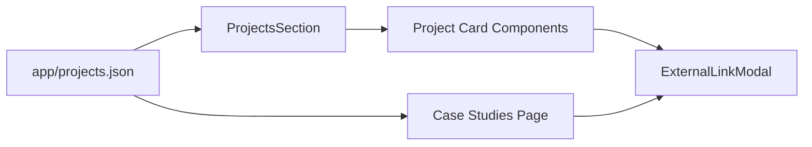

# Buzzlebee — Personal Portfolio

A compact, professional portfolio built with Next.js and Tailwind CSS. This repository contains the source for a statically exported portfolio site showcasing projects, case studies, certifications, and contact flows.

## What this is
- A single-page / multi-route portfolio using the Next.js App Router.
- Projects and case studies are stored in `app/projects.json` (single source of truth).
- External links are gated through a confirmation modal (`ExternalLinkModal`) for safety.

## Key features
- Static export (pre-rendered pages) for fast delivery.
- Centralized project data in `app/projects.json`.
- Firebase Analytics (client-side, SSR-safe) for page and event tracking.
- Small, focused UI built with Tailwind CSS and modern React patterns.
- CI: GitHub Actions workflow to build and deploy (uses `npm run deploy`).

## Tech stack
| Layer | Tool |
|---|---|
| Framework | Next.js (App Router) |
| Language | JavaScript (+ project-level TypeScript support) |
| Styling | Tailwind CSS v4 |
| Analytics | Firebase Analytics (client-only init) |
| Hosting / Deploy | Firebase Hosting (via `firebase-tools`) |
| CI | GitHub Actions |

## Repository layout (selected)
- `app/` — Next.js app routes and components
- `app/projects.json` — projects & case studies data (SSOT)
- `app/components/ExternalLinkModal.js` — modal for external link confirmations
- `lib/firebase.ts` — SSR-safe firebase + analytics helpers
- `public/` — static assets and images
- `.github/workflows/deploy.yml` — CI workflow (build + deploy)

## Local development
Requirements: Node.js (recommended 18+), npm.

1. Install dependencies

```powershell
npm ci
```

2. Run the dev server

```powershell
npm run dev
```

3. Build for production (local verification)

```powershell
npm run build
```

4. Preview the production build

```powershell
npm run start
```

Notes:
- `npm run deploy` runs the build and then `firebase deploy` (the workflow requires `FIREBASE_TOKEN` secret in GitHub to deploy).
- If you're using the GitHub Actions deploy workflow, ensure the repository secret `FIREBASE_TOKEN` is set (Settings → Secrets → Actions).

## Data & content workflow
All project and case-study data live in `app/projects.json`. The app reads this file at build time and renders pages from it. This keeps content edits simple — update the JSON and redeploy.

Mermaid diagram (data flow):



## CI / Deploy notes
- Workflow: `.github/workflows/deploy.yml` (runs on push to `main` by default).
- The workflow installs dependencies and installs `firebase-tools` to ensure `firebase` CLI is available in the runner.
- Add `FIREBASE_TOKEN` as a secret for the repo to allow `firebase deploy` to succeed.

## Security and external links
- All external links are opened through `ExternalLinkModal` to prevent unexpected navigation and to provide a confirmation step.
- External links open in a new tab with `rel="noopener noreferrer"` for safety.

## Contributing & follow-ups
- Small edits: update `app/projects.json` and push to `main`.
- Suggested follow-ups:
  - Add a few frontend tests (Jest/Playwright) for critical pages.
  - Add screenshots or a small demo GIF in this README.
  - Add a `CONTRIBUTING.md` and a license file if you want others to contribute.

## Contact
For questions or updates, contact the maintainer:

- Frank Mathew Sajan — (profile in repo)

---
This README is intentionally concise. If you want a longer version with screenshots, badges (CI, Netlify/Firebase), or an architecture appendix, tell me what to include and I will add it.
This is a [Next.js](https://nextjs.org) project bootstrapped with [`create-next-app`](https://github.com/vercel/next.js/tree/canary/packages/create-next-app).

## Getting Started

First, run the development server:

```bash
npm run dev
# or
yarn dev
# or
pnpm dev
# or
bun dev
```

Open [http://localhost:3000](http://localhost:3000) with your browser to see the result.

You can start editing the page by modifying `app/page.js`. The page auto-updates as you edit the file.

This project uses [`next/font`](https://nextjs.org/docs/app/building-your-application/optimizing/fonts) to automatically optimize and load [Geist](https://vercel.com/font), a new font family for Vercel.

## Learn More

To learn more about Next.js, take a look at the following resources:

- [Next.js Documentation](https://nextjs.org/docs) - learn about Next.js features and API.
- [Learn Next.js](https://nextjs.org/learn) - an interactive Next.js tutorial.

You can check out [the Next.js GitHub repository](https://github.com/vercel/next.js) - your feedback and contributions are welcome!

## Deploy on Vercel

The easiest way to deploy your Next.js app is to use the [Vercel Platform](https://vercel.com/new?utm_medium=default-template&filter=next.js&utm_source=create-next-app&utm_campaign=create-next-app-readme) from the creators of Next.js.

Check out our [Next.js deployment documentation](https://nextjs.org/docs/app/building-your-application/deploying) for more details.
